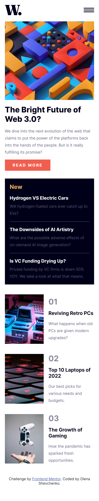

# Frontend Mentor - News homepage solution

## Table of contents

- [Overview](#overview)
  - [The challenge](#the-challenge)
  - [Screenshot](#screenshot)
  - [Links](#links)
  - [Built with](#built-with)
  - [Continued development](#continued-development)
  - [Useful resources](#useful-resources)
- [Author](#author)

## Overview

I am happy to finish this challenge! I thought I will finish it faster, but I stuck on the JavaScript part. Also I had troubles with appearing of nav bar.
I can see where I can improve my code and I can't wait for the next challenge. 

### The challenge

Users should be able to:

- View the optimal layout for the interface depending on their device's screen size
- See hover and focus states for all interactive elements on the page

### Screenshot

 (./assets/images/laptop-screenshots.png)

### Links

- Solution URL: (https://github.com/olenahelena/news-homepage))
- Live Site URL: [Add live site URL here](https://your-live-site-url.com)

### Built with

- Semantic HTML5 markup
- CSS custom properties
- Flexbox
- CSS Grid
- Mobile-first workflow

### Continued development

I would like to learn more about JavaScript function. Because, it's still hard to understand some concepts. I also want to learn how to make navigation bar with more complicated animation. 

### Useful resources

- [Chat Gpt] (https://chat.openai.com/chat) - I have asked a lot of questions about my code and chatGpt answered them. Kind of my menthor.
- [Css tricks] (https://css-tricks.com/guides/) - This was useful for me in searching info about navigation bar. 

## Author

- Website - [Olena Shevchenko](https://github.com/olenahelena)
- Frontend Mentor - [@olenahelena](https://www.frontendmentor.io/profile/olenahelena)
